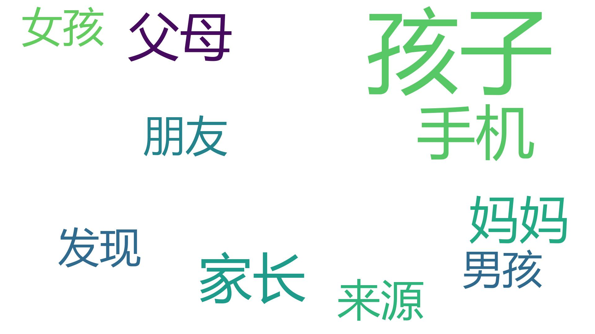
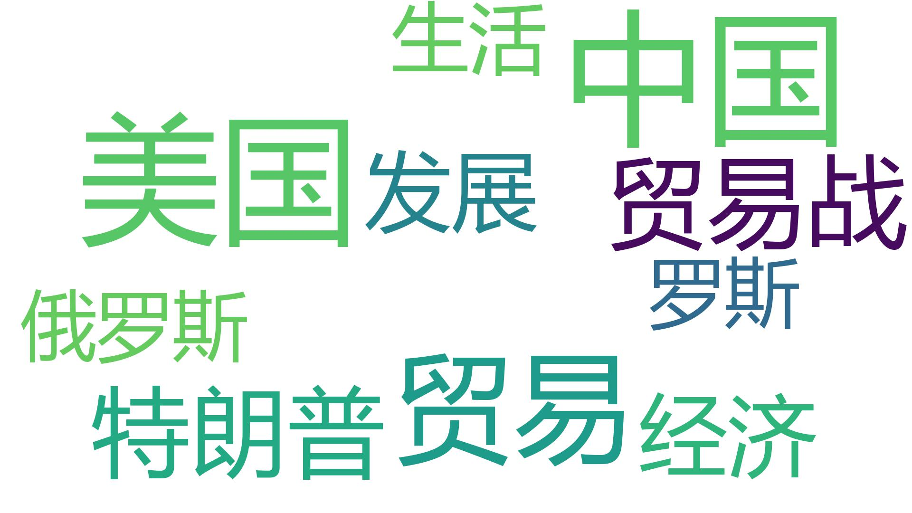
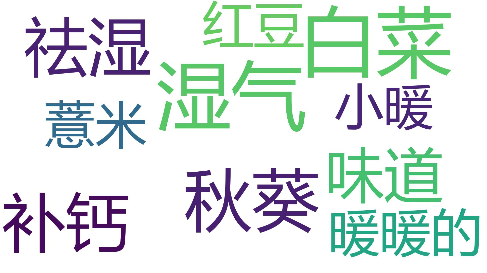
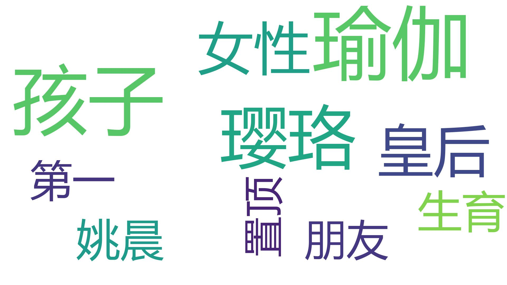
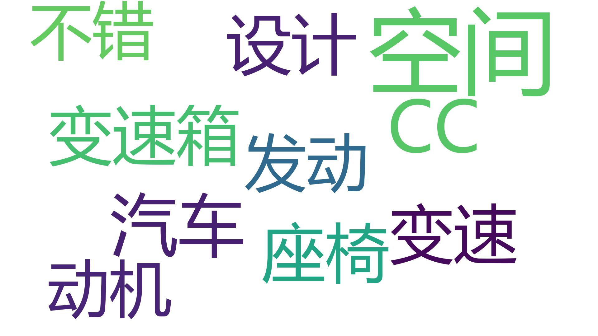
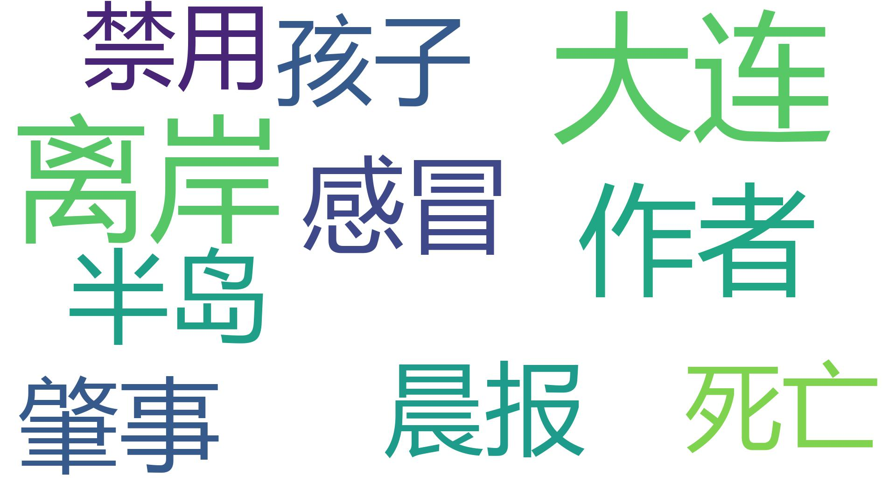
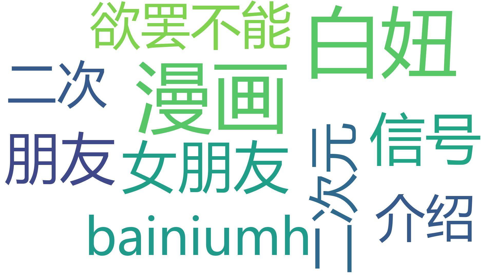
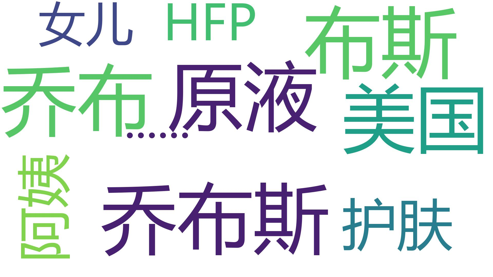
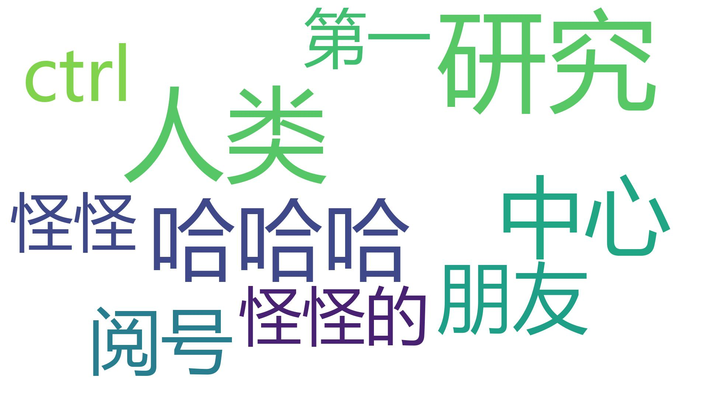
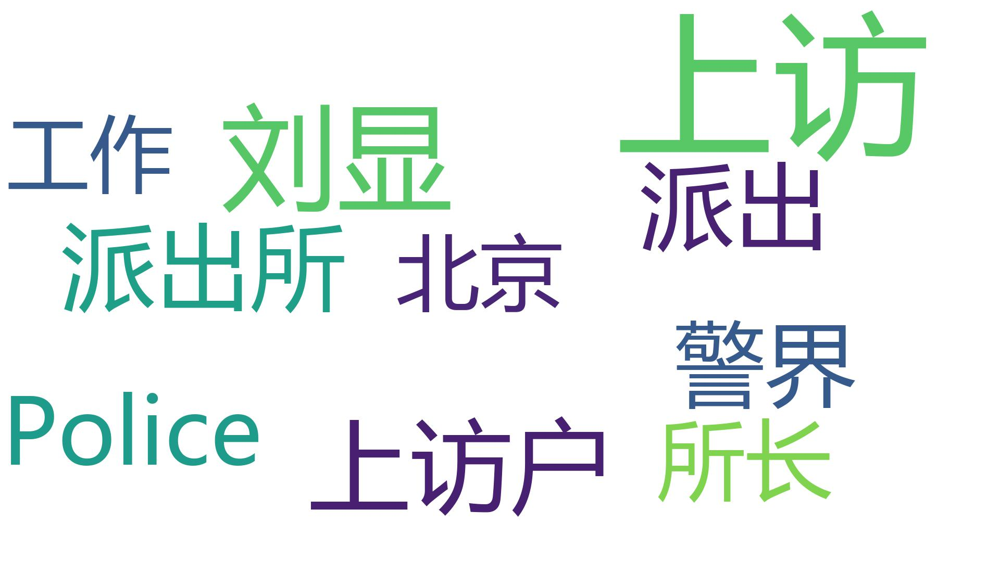

# wechat-ranking
微信公众号10w+文章数据

1. 包含抓取数据爬虫代码
2. 包含微信TOP500(以及TOP行业)文章数据
3. 使用三种语言Node.js、Java、Python
4. 使用多种框架puppeteer/Jsoup/jieba/wordcloud

### 关注公众号回复【10w_article】获取数据及源码 ###

公众号：caiyongji，喜欢直达本质的思考方法，在拓展思维模式上乐此不疲。

# 数据统计 #

## 2018年7月 ##

### 总排名 ###

### 百科 ###

### 财富 ###

### 创业 ###

### 健康 ###

### 教育 ###

### 科技 ###

### 乐活 ###

### 旅行 ###

### 美食 ###

### 美体 ###

### 民生 ###

### 企业 ###

### 汽车 ###

### 情感 ###

### 时尚 ###

### 时事 ###

### 体娱 ###

### 文化 ###

### 文摘 ###

### 幽默 ###

### 政务 ###

### 职场 ###

